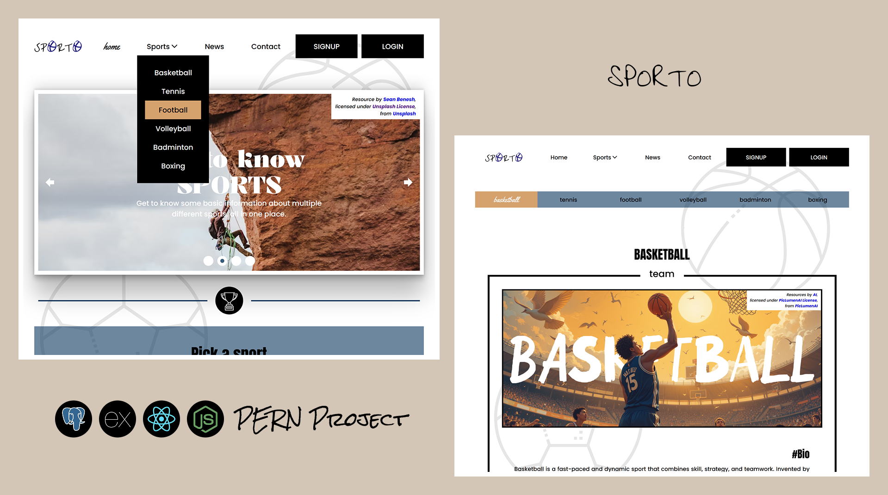

# Sporto (PERN Project)

## Table of contents

- [Preview](#preview)
- [About](#about)
  - [Tools & Requirements](#tools--requirements)   
- [Frontend](#frontend)
  - [SPA & Routing](#spa--routing)
  - [Components (Reusable Code)](#components-reusable-code)
  - [Fetching Data](#fetching-data)
  - [Slider Images & Carousel](#slider-images--carousel)
- [Backend](#backend)
- [Credits](#credits)

## Preview



## About

A website that showcases my full-stack and PERN development skills while helping users learn more about specific sports. The project is designed to provide users with the best possible user experience (UX) and visual appeal (UI) by incorporating key functionalities such as accessibility (including features like skipping sections of content), responsiveness, proper spacing between content, and smooth transitions. Additionally, users can collapse the navigation menu to save space, especially in mobile view.

**Note**: The focus was not on the accuracy of the data or overly emphasizing design but rather on functionality.

### Tools & Requirements

- Mobile-first workflow
- Semantic HTML5 markup
- Single-page application (SPA)
- Reusable code and components
- Frontend: React
- Backend: Express + Node.js
- Runtime: Node.js (for backend)
- Typescript (Frontend + Backend)
- Database: PostgreSQL
- Styling: CSS/SASS
- Accessibility support
- Responsive design (viewport sizes, REM/EM units)
- RESTful API
- Fetching data from a GitHub Pages JSON file
- Signup/Login system
- Nodemailer (email sending service for verification, password reset, etc.)
- Transitions and hover effects
- Dynamic element visibility (based on scrolling and setTimeout)
- Carousel/slider for images

## Frontend

The visual aspect of this website is created through a process that consists of HTML for the structure, CSS (SASS) for styling, and JavaScript/TypeScript for functionality. For a more production-oriented approach and better organization, React is used as a JavaScript library. To prevent unnecessary page reloads when switching between routes, the website follows the Single Page Application (SPA) approach. Some data displayed on the site is fetched from API endpoints, meaning the application waits for a response from the server.

For a better user experience:
- If there is no data available, the user will see a short message such as "There are no records."
- If the response is still pending, a loading component will be displayed.
- If the user navigates to a non-existent route, they will be redirected to a generic "Page not found" (404) page.

### SPA & Routing

A Single-Page Application (SPA) means that the website consists of only one page, and its content is dynamically updated/switched without full page reloads. The react-router-dom library is used to handle routing. When loading a specific route, a loader function can be set up to asynchronously fetch data from a server. The route will only render once the data has been successfully retrieved. To avoid defining a loader for every route that requires data, it is placed at the highest necessary level. Then, using useRouteLoaderData and the assigned id of that route, nested routes can access the loaded data.

The website content follows this structure:
- Page (only one main page)
- Layout (e.g., PageLayout, SportsLayout)
- Routes (e.g., HomePage, SportPage, ContactPage, SignupPage, LoginPage, etc.)


```ts
  // Routing Tree
  const router = createBrowserRouter([
      {
          path: '/',
          id: 'pageLayout',
          element: <PageLayout />,
          loader: routesLoader,
          children: [
              {
                  index: true,
                  element: <HomePage />,
                  loader: heroLoader
              }
          ]
      },
      ...
      {
          path: 'login',
          element: <LoginPage />
      },
      {
          path: '*',
          element: <NotFoundPage />,
      }
  ]);

```

### Components (Reusable Code)

The goal was to create reusable components that can be used multiple times while maintaining clean and readable syntax when passing props. 
Although the internal logic of a component can vary in complexity depending on its functionality, the way it is used and called in the code remains clear and well-structured. This ensures better maintainability and readability throughout the project.

```tsx
  {/* article component */}
  <article>
      <div>
          {headerChildren && (
              headerChildren
          )}
          {contentChildren && (
              <div>
                  {contentChildren}
              </div>
          )}
          {footerChildren && (
              footerChildren
          )}
      </div>
  </article>
```
```tsx
  {/* rendering components */ }
  <Article
    ref={articleRef}
    blockPrefix={blockPrefix}
    headerChildren={
        <Header blockPrefix={blockPrefix} level={level}>...</Header>
    }
    contentChildren={
        <Section
            headerChildren={
                <Heading
                    level={level + 1}
                    title="#Best athletes"
                    visibleTitle={true}
                />
            }
        />
    }
    footerChildren={
        <Footer
            parent={`${blockPrefix}-article`}
            footerStyle={{ width: parWidth + 20 }}
        >
            {Thumbnail && <Thumbnail />}
        </Footer >
    }
/>

```

### Fetching Data

To communicate with the server and retrieve data, the Axios library is used. Since requests are asynchronous, they return a Promise, meaning a response is guaranteed—either in the form of the requested data or an error message.

```ts
  // asyncronous function
  export const fetchSportsData = async (): Promise<Data[]> => {
      const endpoint = import.meta.env.VITE_ENDPOINT;
      const response = await axios.get<Data[]>(endpoint);
  
      return response.data.map((item) => {
          const localImage = sportsImages.find((img) => img.label === item.name);
  
          return {
              name: item.name,
              URL: `${item.name}`,
              ...
          };
      });
  };
  
  // promise
  fetchSportsData()
      .then((data) => {
          console.log(data);
      })
      .catch((error) => {
          console.error('Error fetching data:', error);
      });

```

### Slider Images & Carousel 

- Slider Images (Hero)

  In the hero section, a slider functionality is implemented, allowing four images to change based on user interaction. Users can navigate through the images using control arrows. Each image takes up 100% of the parent’s width, while the parent container moves (translate) based on the current image index.
  
  To achieve this behavior, a state variable is used to dynamically track the currently displayed image:
  - If the first image (index 0) is displayed, the parent does not move.
  - When the second image appears, the parent shifts by 100%, and for each subsequent image, it moves another 100%.
  - A check is required to detect when the last image is reached, so the slider can loop back to the first image seamlessly.


  ```tsx
    const [imageIndex, setImageIndex] = useState<number>(0);
    
    const showNextImage = () => {
        setImageIndex((index) => (index === data.length - 1 ? 0 : index + 1));
    };
    
    const showPrevImage = () => {
        setImageIndex((index) => (index === 0 ? data.length - 1 : index - 1));
    };
    
    <div
        className={`${blockPrefix}-article__images`}
        style={{ transform: `translateX(-${100 * imageIndex}%)` }}
    >
  
  ```

- Carousel

  Users can learn more about a specific sport by clicking on their desired sport in the main menu or through an interactive carousel. Users can navigate the carousel using arrow controls or by dragging with a mouse. When the page loads, several images are displayed, with the number of visible images adjusting based on screen width:
  - Mobile: 1 image
  - Tablet: 2 images
  - Desktop/Laptop: 3 images
    
  ***Mouse click***
  
  Two key aspects are essential for this functionality:
  - Knowing the width of a single card (all cards have the same width).
  - Tracking the scrollLeft property of the container (the list holding the cards).
    
  How It Works:
  - When clicking an arrow, determine whether it’s the left or right button (e.g., using the element’s class).
  - Adjust the scrollLeft value accordingly (increase for right, decrease for left).
  - Since the card width changes dynamically with window resizing, the layout must adapt based on mobile, tablet, or desktop viewports.
  - A resize event listener ensures the card width and arrangement update whenever the window size changes.
  <br/>
  
  ```tsx
    useEffect(() => {
        const updateWidth = () => {
            if (cardRef.current) {
                setCardWidth(cardRef.current.offsetWidth);
            }
        };
        updateWidth();
        window.addEventListener('resize', updateWidth);
        return () => {
            window.removeEventListener('resize', updateWidth);
        };
    }, []);
    
    const movingCarousel = (e: React.MouseEvent<HTMLButtonElement>) => {
        if (!carouselRef.current) return;
        const classLeft = e.currentTarget.classList.contains('carousel-article__controls--left');
        carouselRef.current.scrollLeft += classLeft ? -cardWidth : cardWidth;
    };
  ```

  ***Mouse dragging***

  For smooth drag functionality, we need:
  - The starting point of the drag (captured using the read-only pageX property from the MouseEvent interface).
  - The initial scrollLeft value of the container at the start of the drag.
    
  How It Works:
  - While dragging, continuously update the scrollLeft property based on the difference between the starting pageX value and the current pageX value.
  - To smooth out the drag motion, the difference can be divided by 2 (or another factor) to slow down movement.
  - The mouseup event listener detects when dragging ends, preventing further scrolling.
  <br/>
  
  ```tsx
    const dragStart = (e: React.MouseEvent<HTMLUListElement>) => {
        setIsDragging(true);
        if (carouselRef.current) {
            carouselRef.current.classList.add('dragging');
        }
        setMouseStartX(e.pageX);
        setStartScrollLeft(carouselRef.current?.scrollLeft || 0);
    };
    
    const dragging = (e: React.MouseEvent<HTMLUListElement>) => {
        if (!isDragging || !carouselRef.current) return;
        const distanceMoved = (e.pageX - mouseStartX) / 2;
        carouselRef.current.scrollLeft = startScrollLeft - distanceMoved;
    };
    
    useEffect(() => {
        document.addEventListener('mouseup', dragStop);
        return () => document.removeEventListener('mouseup', dragStop);
    }, []);
    
    const dragStop = () => {
        setIsDragging(false);
        if (carouselRef.current?.classList.contains('dragging')) {
            carouselRef.current.classList.remove('dragging');
        }
    };
  ```

## Backend

## Credits
